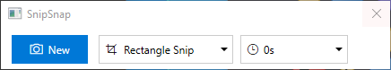
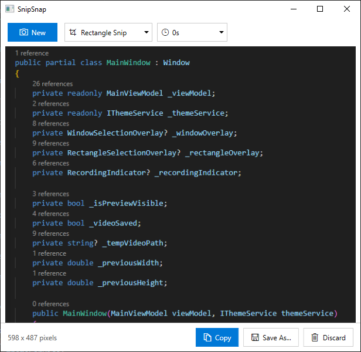
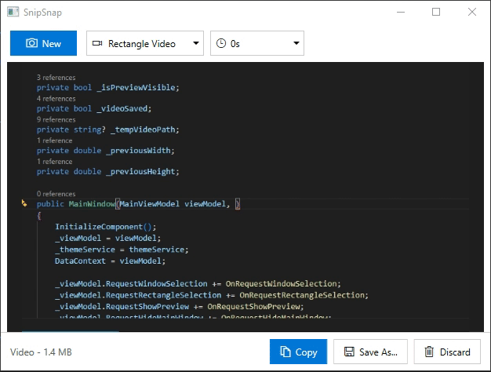

# Snipr

A lightweight Windows screenshot and screen recording application with a clean, native Windows 10 interface.







## Features

- **Screenshot Capture**
  - Rectangle selection - Draw a region to capture
  - Window selection - Click on any window to capture it
  - Fullscreen capture - Capture the entire screen

- **Video Recording**
  - Rectangle region recording
  - Window recording
  - Fullscreen recording

- **Modern Windows 10 UI**
  - Automatic light/dark theme support (follows system settings)
  - Uses your Windows accent color
  - Native Segoe UI font and MDL2 icons

- **Additional Features**
  - Configurable capture delay (0-5 seconds)
  - Copy to clipboard or save to file
  - Preview before saving

## System Requirements

- Windows 10
- .NET 8.0 Runtime
- x64 architecture

## Building from Source

```bash
# Clone the repository
git clone https://github.com/chapelsoftware/snipr.git
cd snipr

# Build
dotnet build -c Release -p:Platform=x64

# Run
dotnet run --project src/Snipr -p:Platform=x64
```

## Keyboard Shortcuts

| Shortcut | Action |
|----------|--------|
| Ctrl+N | New capture |
| Ctrl+Shift+Q | Stop recording |
| Ctrl+C | Copy to clipboard (in preview) |
| Ctrl+S | Save to file (in preview) |
| Escape | Cancel capture / Discard preview |

## Third-Party Libraries

Snipr uses the following open-source libraries:

| Library | Version | License | Description |
|---------|---------|---------|-------------|
| [CommunityToolkit.Mvvm](https://github.com/CommunityToolkit/dotnet) | 8.4.0 | MIT | MVVM framework with source generators |
| [Microsoft.Extensions.DependencyInjection](https://github.com/dotnet/runtime) | 8.0.0 | MIT | Dependency injection container |
| [ScreenRecorderLib](https://github.com/sskodje/ScreenRecorderLib) | 6.6.0 | MIT | Screen recording using Windows Graphics Capture API |
| [System.Drawing.Common](https://github.com/dotnet/runtime) | 8.0.0 | MIT | GDI+ graphics functionality |

### License Details

**CommunityToolkit.Mvvm** - MIT License
```
Copyright (c) .NET Foundation and Contributors
```

**Microsoft.Extensions.DependencyInjection** - MIT License
```
Copyright (c) .NET Foundation and Contributors
```

**ScreenRecorderLib** - MIT License
```
Copyright (c) 2019 sskodje
```

**System.Drawing.Common** - MIT License
```
Copyright (c) .NET Foundation and Contributors
```

## License

MIT License

Copyright (c) 2024 Chapel Software

Permission is hereby granted, free of charge, to any person obtaining a copy
of this software and associated documentation files (the "Software"), to deal
in the Software without restriction, including without limitation the rights
to use, copy, modify, merge, publish, distribute, sublicense, and/or sell
copies of the Software, and to permit persons to whom the Software is
furnished to do so, subject to the following conditions:

The above copyright notice and this permission notice shall be included in all
copies or substantial portions of the Software.

THE SOFTWARE IS PROVIDED "AS IS", WITHOUT WARRANTY OF ANY KIND, EXPRESS OR
IMPLIED, INCLUDING BUT NOT LIMITED TO THE WARRANTIES OF MERCHANTABILITY,
FITNESS FOR A PARTICULAR PURPOSE AND NONINFRINGEMENT. IN NO EVENT SHALL THE
AUTHORS OR COPYRIGHT HOLDERS BE LIABLE FOR ANY CLAIM, DAMAGES OR OTHER
LIABILITY, WHETHER IN AN ACTION OF CONTRACT, TORT OR OTHERWISE, ARISING FROM,
OUT OF OR IN CONNECTION WITH THE SOFTWARE OR THE USE OR OTHER DEALINGS IN THE
SOFTWARE.

## Contributing

Contributions are welcome! Please feel free to submit a Pull Request.
